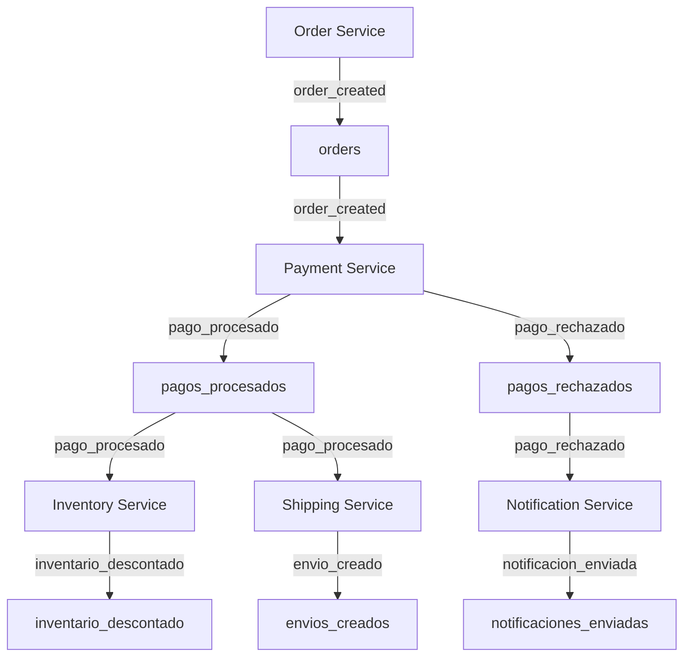

# Prueba de Concepto (PoC) - EDA Ecommerce Microservices

## Descripción de la prueba

Esta prueba de concepto modela un sistema de ecommerce basándose en la documentación AsyncAPI como punto de partida para un enfoque design-first. A partir de las especificaciones AsyncAPI, se genera un sistema que cumple con el modelado inicial y las definiciones de canales, mensajes y flujos de eventos, asegurando que la implementación siga la arquitectura definida.

## Objetivo(s) de la prueba

- Validar el uso de AsyncAPI como herramienta central para documentar y modelar la comunicación entre microservicios.
- Demostrar cómo AsyncAPI ayuda a entender, mantener y escalar sistemas basados en eventos.
- Comprobar la integración de microservicios usando RabbitMQ para el intercambio de eventos.
- Mostrar la trazabilidad de eventos y logs generados por cada servicio.

## Pasos implementados para llevar a cabo la prueba

1. **Modelado del sistema con AsyncAPI:**
   - Definir, antes de desarrollar, todos los eventos, mensajes, canales y flujos que se usarán en el sistema.
   - Especificar qué servicios publican y consumen cada evento, qué datos entran y salen, y cómo se integran usando RabbitMQ como message broker.
   - Documentar todo en archivos AsyncAPI YAML, asegurando que la arquitectura esté clara y replicable.

2. **Configuración del entorno y message broker:**
   - Preparar el proyecto y clonar el repositorio.
   - Instalar dependencias.
   - Montar RabbitMQ con Docker para una arquitectura replicable y aislada.

3. **Despliegue de microservicios (ejemplo visual):**
   - Implementar el sistema en JavaScript usando NestJS como framework (aunque podría usarse cualquier stack compatible con RabbitMQ).
   - Configurar los listeners y servicios según lo definido en AsyncAPI.

4. **Ejecución de la prueba:**
   - Realizar una petición POST a http://localhost:3000/order con un body `{ "orderId": 123 }`.
   - Observar el flujo de eventos y los logs generados por cada servicio.

5. **Visualización de eventos y validación:**
   - Analizar los logs para los casos de pago aprobado y pago rechazado.
   - Consultar la documentación AsyncAPI para entender el flujo y los datos.
   - Validar que el sistema implementado cumple con el diseño inicial, incluso pudiendo automatizar la generación de código a partir de la especificación.

## Tecnologías usadas en la prueba

- **AsyncAPI:** Documentación y estandarización de eventos y canales.
- **Lenguaje:** TypeScript
- **Framework:** NestJS
- **Mensajería:** RabbitMQ (usando Docker)
- **Diagrama:** Mermaid (para visualizar el flujo de eventos)

## Diagrama de eventos y colas



## Resultados

- La documentación AsyncAPI permite visualizar y entender el flujo de eventos entre servicios.
- El flujo de eventos se ejecuta correctamente:
  - Al crear un pedido, se publica el evento `order_created`.
  - El Payment Service procesa el pago y publica `pago_procesado` o `pago_rechazado`.
  - Inventory y Shipping Service actúan sobre pagos aprobados.
  - Notification Service notifica pagos rechazados.
- Los logs reflejan el procesamiento de cada evento:
  - Ejemplo de log para pago aprobado:
    ```
    Orden recibida en PaymentListener: 123
    Evento emitido: pago_procesado { orderId: 123, status: 'approved' }
    Inventario descontado para orderId: 123
    Envío creado para orderId: 123
    ```
  - Ejemplo de log para pago rechazado:
    ```
    Orden recibida en PaymentListener: 123
    Evento emitido: pago_rechazado { orderId: 123, reason: 'Fondos insuficientes' }
    Notificación enviada para orderId: 123
    ```

## Conclusiones

- AsyncAPI es fundamental para modelar, documentar y mantener sistemas de microservicios basados en eventos.
- Permite a equipos entender rápidamente los flujos, canales y mensajes sin necesidad de revisar el código.
- La arquitectura EDA, combinada con AsyncAPI, facilita la escalabilidad y la integración de nuevos servicios.
- RabbitMQ es eficiente para el intercambio de eventos, pero AsyncAPI aporta claridad y estandarización.
- El PoC demuestra cómo los eventos pueden orquestar procesos complejos en un ecommerce y cómo AsyncAPI potencia la trazabilidad y el diseño.

---

Esta prueba de concepto valida el enfoque design-first usando AsyncAPI para microservicios en ecommerce, mostrando el protagonismo de AsyncAPI en la documentación, trazabilidad y buenas prácticas de integración.
