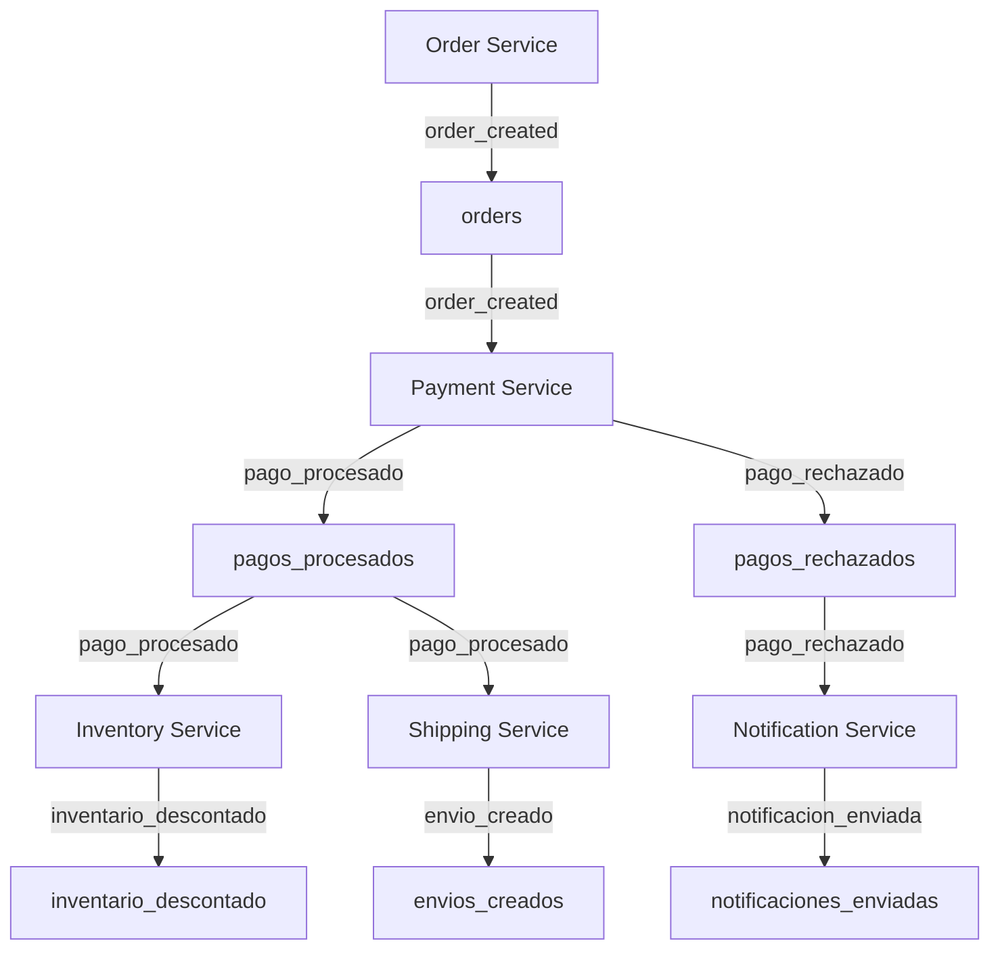

# EDA Ecommerce Microservices

Este proyecto implementa una arquitectura orientada a eventos (EDA) para un sistema de ecommerce, utilizando microservicios y RabbitMQ como broker de mensajes.

## Objetivo

Demostrar cómo los distintos servicios de un ecommerce (órdenes, pagos, inventario, envíos y notificaciones) pueden comunicarse de manera desacoplada mediante eventos, usando RabbitMQ y AsyncAPI para documentar los canales de comunicación.

## Estructura del Proyecto

```
asyncapi-eda-ecommerce/
├── src/
│   ├── app.controller.ts
│   ├── app.module.ts
│   ├── main.ts
│   ├── docs/
│   │   └── async-api/
│   │       ├── inventory-service.yaml
│   │       ├── notification-service.yaml
│   │       ├── order-service.yaml
│   │       ├── payment-service.yaml
│   │       ├── shipping-service.yaml
│   └── listeners/
│       ├── inventory.listener.ts
│       ├── notification.listener.ts
│       ├── payment.listener.ts
│       ├── shipping.listener.ts
```

## Documentación

Cada servicio tiene su especificación AsyncAPI en `src/docs/async-api/`, donde se definen los canales (eventos) que utiliza para comunicarse:
- order_created
- pago_procesado
- pago_rechazado
- inventario_descontado
- envio_creado
- notificacion_enviada

Los canales están diseñados para mapearse a colas de RabbitMQ, sin parámetros dinámicos.

## Diagrama eventos



## Instalación

1. **Clona el repositorio:**
   ```bash
   git clone <repo-url>
   cd asyncapi-eda-ecommerce
   ```

2. **Instala dependencias:**
   ```bash
   npm install
   ```

3. **Levanta RabbitMQ con Docker:**
   ```bash
   docker run -d --name rabbitmq -p 5672:5672 -p 15672:15672 rabbitmq:3-management
   ```
   Accede a la consola de administración en http://localhost:15672 (usuario/contraseña: guest/guest).

4. **Inicia la aplicación:**
   ```bash
   npm run start:dev
   ```

## ¿Qué busca este proyecto?

- Desacoplar servicios usando eventos.
- Documentar la comunicación entre servicios con AsyncAPI.
- Usar RabbitMQ como broker de eventos.
- Ejemplificar patrones de microservicios en Node.js/NestJS.

## Servicios

- **Order Service:** Publica eventos de creación de pedidos.
- **Payment Service:** Procesa pagos y publica eventos de pago procesado/rechazado.
- **Inventory Service:** Descuenta inventario tras pago procesado.
- **Shipping Service:** Gestiona envíos tras pago procesado.
- **Notification Service:** Notifica al usuario tras pago rechazado o envío creado.

## Requisitos

- Node.js >= 14
- Docker
- RabbitMQ

## Ejemplo de petición para crear un pedido

Dirígete a:

- URL: http://localhost:3000/api
- Método: POST/order
- Body:
  ```json
  {
    "orderId": 123
  }
  ```

El único dato requerido en el body es `orderId`. Esto es solo para la prueba de conceptos; para un consumo real o agregar lógica de negocio, puedes extender el body con otros datos como `userId`, `total`, etc.

### Ejemplo de logs

- **Pago aprobado:**
  - PaymentListener:
    ```
    Orden recibida en PaymentListener: 123
    Evento emitido: pago_procesado { orderId: 123, status: 'approved' }
    ```
  - InventoryListener:
    ```
    Inventario descontado para orderId: 123
    ```
  - ShippingListener:
    ```
    Envío creado para orderId: 123
    ```

- **Pago rechazado:**
  - PaymentListener:
    ```
    Orden recibida en PaymentListener: 123
    Evento emitido: pago_rechazado { orderId: 123, reason: 'Fondos insuficientes' }
    ```
  - NotificationListener:
    ```
    Notificación enviada para orderId: 123
    ```
